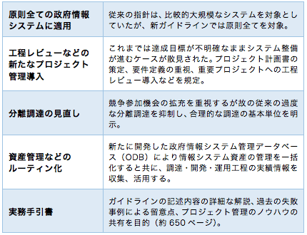
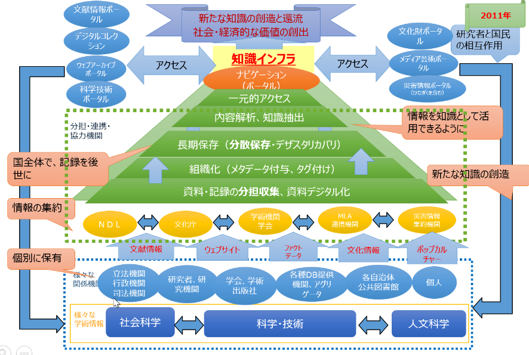
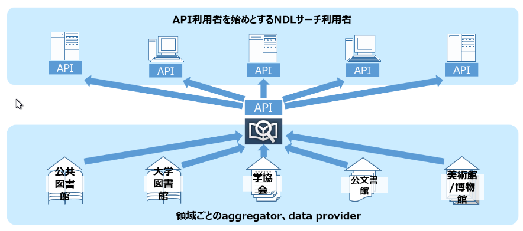
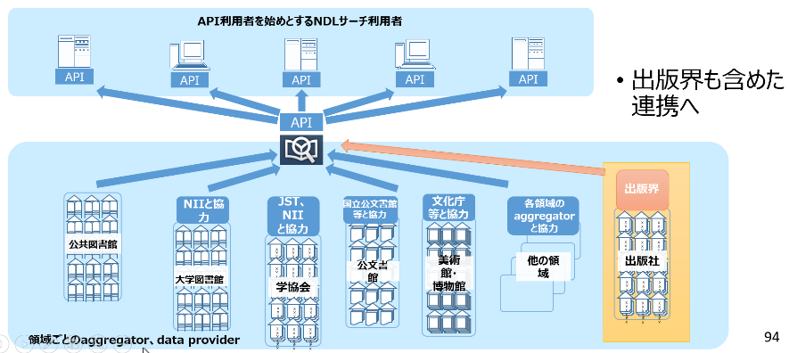
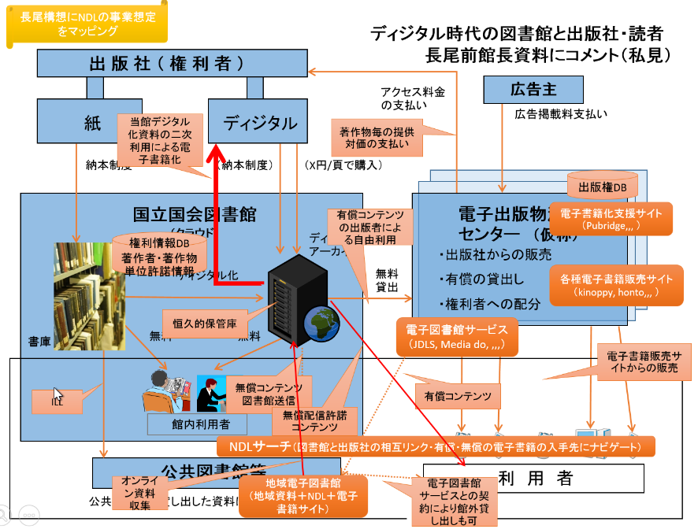
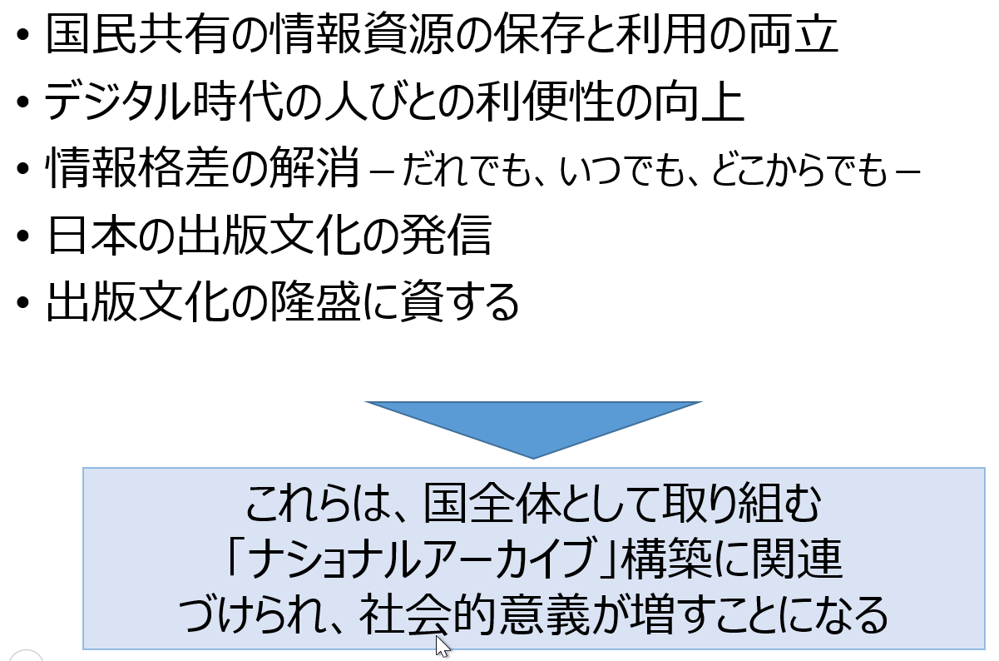
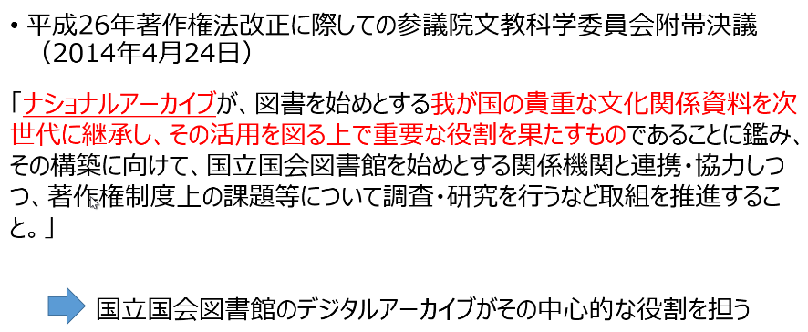

DAW05-00【抜粋】政府の新しいガイドラインによる開発と人材育成

2016年4月15日

中山正樹

政府の新しいガイドラインによる開発と人材育成
============================================

システム開発及び人材育成・確保に関して政府の新しい方法論
--------------------------------------------------------

{width="5.905555555555556in"
height="3.0881944444444445in"}

政府における業務システム最適化のガイドラインの見直し

⇒

政府情報システムの整備及び管理 に関する標準ガイドライン

（2014年12月3日 各府省情報化統括責任者（CIO）連絡会議決定）

「政府情報システムの整備及び管理に関する標準ガイドライン」・「実務手引書」\
http://www.soumu.go.jp/main\_sosiki/gyoukan/kanri/infosystem-guide.html

iコンピテンシ・ディクショナリ

新時代のビジネスモデルに求められるタスクやスキル、役割分担例

（2015年夏　情報処理振興機構　正式版公開）

i コンピテンシ ディクショナリ概要：

https://www.ipa.go.jp/jinzai/hrd/i\_competency\_dictionary/icd.html

i コンピテンシ ディクショナリ2015：

https://www.ipa.go.jp/jinzai/hrd/i\_competency\_dictionary/download.html

情報システムの構築のプロセスと必要なスキル
------------------------------------------

{width="5.905555555555556in" height="2.875in"}

情報システムは、サービスを効率的・効果的に実現する手段

その情報システムを第三者とともに効率的に構築するために

システム開発の標準ガイドラインの参照

その情報システムのタスクを遂行するために

タスクに必要なスキル、スキルを必要な知識を選択的に習得

政府標準ガイドラインに沿ったシステム開発手順と作成するドキュメント

iコンピテンシ・ディクショナリを活用した効率的なスキル・知識の習得

標準ガイドラインの概要
----------------------

{width="5.905555555555556in"
height="4.313888888888889in"}

過度な分離調達を抑制

実務手引書（2015年度に作成）

～～～～～～

既存ガイドラインとの関係

従来の「業務・システム最適化指針」、「行政機関におけるIT人材の育成・確保指針」、「情報システムに係る政府調達性の見直しについて」、「情報システムに係る調達の基本指針」を廃止して、

新たに「政府情報システムの整備および管理に関する標準ガイドライン」として再構成。

人材の育成・確保の留意点

{width="5.905555555555556in"
height="3.634027777777778in"}

人事ローテーションの工夫を検討するなど、中長期的な視点に立って計画的に推進。

専門的・技術的な知識・能力だけでなく、業務分析、業務の見直しの企画立案、プロジェクト管理等の能力の取得が重要。

業務は、情報システムを活用してデータの作成や活用ができることが不可欠。一般職員のITリテラシの向上にも努めることが重要。

～～～～～

引用）第2回　「政府情報システムの整備及び管理に関する標準ガイドライン」（その1）－概要および要件定義と調達－【MRI】
-------------------------------------------------------------------------------------------------------------------

（[*http://www.mri.co.jp/opinion/column/gov\_info/gov\_info\_20150410\_1.html*](http://www.mri.co.jp/opinion/column/gov_info/gov_info_20150410_1.html)）

#### ■標準ガイドラインの概要

{width="4.479166666666667in" height="3.4375in"}

従来、ベンダーやソフトウエア会社は自社の開発標準を有していた。しかしながら、開発工程の定義や作業内容、用語、ドキュメント様式などが異なっており、会社が違えば「同じ言葉で話す」ことが難しかった。それを解決する共通の枠組みとして、ソフトウエア・ライフサイクル・プロセスを標準化した共通フレームが定義された。この共通フレームは1994年の共通フレーム2004から、2007年の共通フレーム2007を経て、現在は共通フレーム2013へと進化しているが、業務・システム最適化計画を始める2005年頃は一般的に普及しているとは言えなかった。

そのため業務・システム最適化計画を進めるにあたり、共通フレームでいうところの特に要件定義プロセスで、共通的な表現でシステムを「見える化」することを目的にEA（エンタープライズ・アーキテクチャ）の概念が導入され、そのためのドキュメント体系が定義されることとなった。計画を進める中で「業務・システム最適化指針」、「情報システムに係る政府調達の基本指針」、「電子政府ユーザビリティガイドライン」などが作成されてきたが、それぞれカバーする分野が異なっており、プロジェクトを進めるにあたり常に複数のガイドラインを参照する必要があった。また、これらガイドラインを利用する中で、改善すべき部分も見えてきた。

そのような状況の下、「世界最先端IT国家創造宣言」（2013年6月）で政府のITガバナンス強化施策の一つとして、情報システム調達やプロジェクト管理に関する共通ルールなどを整備するという方針が示された。図1は既存の指針と新しい標準ガイドラインとの関係を示したものである。これまで活用されてきた指針は廃止され、それぞれの内容を現状に則したものに見直した上で、図右側に示す標準ガイドラインの記載項目に取り込まれている。

#### ■要件定義

{width="5.905555555555556in"
height="2.1527777777777777in"}

*要件定義は、情報システムを整備する上で「どのようなシステムを実現するか」の絵姿を描く重要な作業であり、その成果物である要件定義書は後工程の重要なインプットとなる。さらに、見積もりや、特に政府においては調達のための主要なドキュメントの一つとして位置付けられる。*

要件定義が不十分なまま構築を進めたため、システムが所期の目的を十分に果たせない、あるいは工程上の手戻りが発生し費用や開発期間の面で問題を残したという例も見受けられる。そのため標準ガイドライン､特に実務手引書では、業務の見直しとそれに伴う要件定義の部分にかなりのページ数を割いて、必要な作業や要件定義書の記載項目を定めている。要件定義の確定は、設計・構築事業者を調達する前と、事業者が決定し設計作業を開始する前の2段階で行うこととしており、特に調達前にどこまで要件定義を精緻化できるかがポイントとなる。

#### ■調達

従来の指針に基づいた調達には、大きく以下の二つの課題があった。標準ガイドライン（実務手引書を含む）は、これらに対する解決の糸口を与えるものとなっている。

(1)調達単位

従来は公平性の確保、調達機会の拡大等の観点から、例えば、基盤システムと業務システム、ハードウエアとソフトウエア製品、アプリケーションの保守など可能な限り調達単位を分けるという「分離調達」が推奨されていた。しかしながら、調達を分離することでプロジェクトが複数の事業者により構成されることとなり、管理の難易度が増したためにプロジェクトの品質低下や期限遅れを生ずるなど、過度な分離調達による弊害が発生することもあった。

そのため、標準ガイドラインでは発注者が適切に管理・統合できることを前提に、合理的な調達範囲を検討することとされている（例えば「設計業務」と「開発業務」の統合など）。「合理的」の解釈には難しいものがあるが、PMO※2、CIO補佐官の判断や意見招請なども活用しつつ、実現可能性と競争性の確保のバランスを取ることが重要となる。

(2)選定方式

もう一つの大きな課題は、選定方式である。比較的機能が単純で仕様を明確に記述可能なもの（例えばプリンターなどのハードウエア）については、最低価格落札方式でも一定の仕様を満足するものを調達することが可能であり、大きな問題を生ずることは少ない。

一方、アプリケーションプログラムの設計・開発のように、入札者の技術的要素を評価することが重要なものもある。このような場合、価格要素と技術要素を総合的に評価する「総合評価落札方式」を採用することが有効である。従来は価格評価点と技術評価点の配分は原則1対1とされていた※3。そのため、技術評価点で相当程度の差がついていたとしても、低価格で入札することにより落札できる可能性が大きかった。標準ガイドラインでは、適用範囲に該当すれば価格評価点と技術評価点の配分を1対3まで選択できることが明記され、調達案件ごとの最適な調達方式選択の幅が広がった。

{width="5.905555555555556in"
height="3.4902777777777776in"}

ガイドラインに示す計画書等の関係（概要）
----------------------------------------

{width="5.905555555555556in"
height="3.7819444444444446in"}

システム開発業務の成果物となる各種計画書の関係

人材の育成・確保の留意点
------------------------

{width="5.905555555555556in"
height="3.296284995625547in"}

人事ローテーションの工夫を検討するなど、中長期的な視点に立って計画的に推進。

専門的・技術的な知識・能力だけでなく、業務分析、業務の見直しの企画立案、プロジェクト管理等の能力の取得が重要。

業務は、情報システムを活用してデータの作成や活用ができることが不可欠。一般職員のITリテラシの向上にも努めることが重要。

政府標準ガイドラインに沿ったタスクプロフィールとドキュメント
------------------------------------------------------------

{width="5.905555555555556in"
height="3.0743055555555556in"}

政府標準ガイドラインは概要編、実務者手引書等で構成される

・組織としての事業計画に基づいた、業務・サービスの企画段階から、運用・保守、その後のシステム監査までのタスクと、その各工程でのドキュメントを抜き出したもの

・全体の流れを掴むために提示

調達方式の決定の判断
--------------------

{width="5.905555555555556in" height="3.16875in"}

■基本は、一般競争入札（最低価格落札方式）

・仕様書の解釈により、実施内容にブレがでない詳細な仕様提示が必要【ハードウェア類】

・予定価格の妥当性の評価は必要だが、業者見積もりの妥当性は評価する能力は求められない

■一般競争入札（総合評価落札方式）【ソフトウェア類】

・提案者の創意工夫の余地を残し、提案内容の優劣を技術点で評価する

■企画競争

・具体的な実装方式を特定せず、提案者の創意工夫の内容の優劣で評価する

・業者を選定後は、随意契約として扱われる

■随意契約

・業者の言いなりにならないようにすることが肝要

実施内容と業者見積もり額の妥当性を精緻に評価する能力が必要

調達方式の違いと仕様書の精緻度
------------------------------

{width="5.905555555555556in" height="3.35625in"}

提案依頼書（RFP）は、調達方式に寄らず作成する必要がある

一般競争入札（最低価格落札方式）が最も、より精緻な要件定義能力が求められる

随意契約は、より精緻な実施内容・見積価格評価能力が求められる

外部委託に必要なドキュメントと手続き（一般競争入札）
----------------------------------------------------

{width="5.905555555555556in"
height="3.0590277777777777in"}

・業務要件書は、要件定義書に含まれる

・要件定義書は、調達仕様書に含まれる

・調達仕様書は、提案依頼書に含まれる

工程ごとに様々な仕様書類を作成することになるが、そのもとは、事業計画であり、個別のプロジェクト計画から作成され、それぞれが引用されていく

・つまり、作業が進んだ段階で計画が変更になれば、プロジェクト計画書にフィードバックする

必要がある

各種ドキュメントに記載されるべき項目
------------------------------------

{width="5.905555555555556in"
height="3.1770833333333335in"}

各種ドキュメントに記載されるべき項目列挙したもの

要件定義書記載項目（全体）
--------------------------

{width="5.905555555555556in" height="3.05in"}

要件定義書記載項目（全体）

開発したい内容の仕様は、機能要件で記載される

しかし、機能ではなく、性能その他、ここに列挙したような事項も明確にしていく必要がある

●

-   業務要件

    -   業務実施手順

    -   規模

    -   時期・時間

    -   場所等

    -   管理すべき指標

    -   情報システム化の範囲

    -   業務の継続の方針等

    -   情報セキュリティ

-   機能要件

    -   機能に関する事項

    -   画面に関する事項

    -   帳票に関する事項

    -   情報・データに関する事項

    -   外部インタフェースに関する事項

-   非機能要件

    -   ユーザビリティ及びアクセシビリティに関する事項

    -   システム方式に関する事項

    -   規模に関する事項

    -   性能に関する事項

    -   信頼性に関する事項

    -   拡張性に関する事項

    -   中立性に関する事項

    -   継続性に関する事項

    -   情報セキュリティに関する事項

    -   情報システム稼働環境に関する事項

    -   テストに関する事項

    -   移行に関する事項

    -   引継ぎに関する事項

    -   教育に関する事項

    -   運用に関する事項

    -   保守に関する事項

要件定義書記載項目（業務要件）
------------------------------

{width="5.905555555555556in"
height="3.254166666666667in"}

要件定義書記載項目の１つとして、業務要件

その他に関しては、このあと、別途。

●

-   業務実施手順

    -   業務の範囲（業務機能とその階層）
        、業務フロー図、業務の実施に必要な体制、入出力情報項目及び取扱量

-   規模

    -   サービスの利用者数、単位（年、月、日、時間等）当たりの処理件数

-   時期・時間

    -   *業務の実施時期、期間及び繁忙期等*

-   場所等

    -   *業務の実施場所、諸設備、必要な物品等の資源の種類及び量等*

-   管理すべき指標

    -   *業務の運営上補足すべき指標項目、把握手順・手法・頻度　等*

-   情報システム化の範囲

    -   情報システムを用いて実施する業務の範囲及び情報システムを用いずに実施する業務の範囲

-   業務の継続の方針等

    -   業務の継続に伴うリスク及び基本的な考え方。なお、*業務継続計画を策定する必要がある業務にあっては当該計画の策定時に検討*

        -   定常時と大規模災害等の発災時に考慮すべき要因

    -   *（*情報システムの非機能要件（信頼性、継続性等）の前提*）*

-   情報セキュリティ

    -   取り扱われる情報の格付・取扱制限等に応じた情報セキュリティ対策の基本的な考え方

    -   情報セキュリティ上のリスクを特定し、その対策をシステム化要件（機能要件及び非機能要件）として定義できるように、

    -   情報セキュリティ対策の対象となる情報について、情報セキュリティポリシーに準拠した格付の区分及び取扱制限を明確化

政府情報システムの整備及び管理に関する標準ガイドライン【内容要約】
==================================================================

-   [*政府情報システムの整備及び管理に関する標準ガイドライン【本文要約】*](【最新版】【文書】政府情報システムの整備及び管理に関する標準ガイドライン【本文要約】.docx)

政府情報システムの整備及び管理に関する標準ガイドライン（実務手引書】【内容要約】
================================================================================

-   [*政府情報システムの整備及び管理に関する標準ガイドライン【本文要約】*](file:///C:\Users\t6014250\Documents\参考資料\外部講演用資料\限定公開\20160604版\【分冊】WORD\【最新版】【文書】政府情報システムの整備及び管理に関する標準ガイドライン【本文要約】.docx)

情報システムの構築に必要なスキルと知識
======================================

業務遂行のタスクとスキル・知識の蓄積の関係
------------------------------------------

{width="5.905555555555556in"
height="3.2784722222222222in"}

・事業を実施するために、業務がある。業務の固まりが「タスクプロフィール」

・１つ１つのタスクプロフィールは、様々なタスクで構成される

・タスクの種類を列挙したものが、タスクディクショナリ（415項目）

・１つ１つのタスクを実施するためには、様々なスキルが必要

・スキルの種類を列挙したものが、スキルディクショナリ（XX項目）

・１つ１つのスキルは、経験と様々な知識により身に付く

・知識の種類を列挙したものが、知識ディクショナリ（XX項目）

●

・全てのスキルと知識を身に付いていれば、どんなタスクもこなせるが、そんな人はいない

・現在の職務に必要なスキル・知識を選択的に習得し、最終的に網羅性に確保する実践的なアプローチが、iコンピテンシ・ディクショナリの考え方

●

・業務を遂行するためには、的確に判断し、指示できるレベルのスキル・知識が必要であり

・業務に必要なスキル・知識を、事前に選択的に習得して、業務を遂行する。

・しかし、業務を遂行する前に持っていないスキル・知識は、タスクの遂行を通じて習得する（いわゆるOJT）

●

・知識のレベルを評価するものが、情報技術者試験制度である。

・知識の網羅性は評価認定できるが、その知識を活用した実践的なスキルは評価できない

政府の標準ガイドライン/iCDを活用した業務の遂行とスキル・知識の選択的習得
------------------------------------------------------------------------

{width="5.905555555555556in"
height="3.296527777777778in"}

政府の標準ガイドライン/iコンピテンシ・ディクショナリを活用した業務の遂行とスキル・知識の選択的習得をブレークダウンしたもの

●

・図書館におけるデジタルアーカイブ事業を念頭にタスクプロフィールを仮定

・今後説明するデジタルアーカイブ構築プロジェクトを、政府標準ガイドラインに沿った業務jの工程（タスクプロフィール）で想定し、その中の個々のタスクに必要なスキルを選択

・そのスキルを身につけるためのベースとなる知識を選択

●

・サービス構築・運用のためのスキル・知識は、右上の「スキル・知識提供機関」でのセミナー等により習得

・「スキルを活用」して、左の政府標準ガイドラインに沿ったタスクを遂行

・タスクを遂行することにより、「OJTによりスキルを習得」

●

・右の黒い部分は、情報処理技術者試験の分類、左から右に向かってレベルが高くなる

タスクディクショナリ
--------------------

### 【非表示】タスクディクショナリ構成図（IPA）

{width="5.905555555555556in"
height="3.4055555555555554in"}

・「タスクディクショナリ」は、企業や組織が経営戦略・事業計画に沿って自タスクを定めるために利活用する。どのようなビジネス形態の企業であっても利活用できるよう、広範囲な企業活動を想定した構成となっている。

・また、タスクディクショナリには、「タスクディクショナリ構成図」、および「タスクプロフィール」

が含まれており、自タスクを策定する際の参考情報として利用することを想定している。

・タスクディクショナリ構成図には、ビジネスのライフサイクル（戦略、企画、開発、利活用、評価・改善）と、「計画・実行」、「管理・統制」、「推進・支援」「その他業務」の4
つのタスク群からなるタスクの構成が表されている。タスク大分類単位でタスクディクショナリの全体像を俯瞰することで、自タスクの策定に利用することを想定している。

### タスクディクショナリ（中分類）

{width="5.905555555555556in"
height="3.3666666666666667in"}

スキルディクショナリ（IPA）
---------------------------

{width="5.905555555555556in"
height="3.3493055555555555in"}

●

「スキルディクショナリ」は、スキルに着目して育成活動を進めることができるように、スキルディクショナリ単独で利活用できる構造になっている。情報処理技術者試験をはじめとする各種資格・認定試験、および学校関係や教育事業者のカリキュラムと結びつけた利用を想定している。

スキルディクショナリは、スキル標準、情報処理技術者試験の知識項目例や主要知識体系を参照元とし、IT
関連業務の遂行に必要なスキル・知識項目を集約し一覧化している。

●

スキルディクショナリは、スキルの特性に基づき「メソドロジ」、「テクノロジ」、「関連知識」、「ITヒューマンスキル」の4
つのカテゴリに分類されている。

●

**(1)** メソドロジ

メソドロジカテゴリは、IT
ビジネス活動の様々な局面で発揮される手法、方法などで、発揮される対象領域が広く、汎用性、応用性が高いスキルを集めたものである。

**(2)** テクノロジ

テクノロジカテゴリは、IT ビジネス活動の様々な局面で発揮されるIT
関連技法などで、対象領域が特定されるものが多いスキルを集めたものである。

**(3)** 関連知識

関連知識のカテゴリは、IT
ビジネス活動の様々な局面で活用される、メソドロジ、テクノロジ以外の関連業務知識を集めたものである。

**(4) IT** ヒューマンスキル

IT ヒューマンスキルは、IT
ビジネス活動の様々な局面で頻繁に発揮される基本スキルカテゴリである。3
分類、12
スキル項目で構成され、「メソドロジ、テクノロジ、関連知識」と同様にタスクの遂行において発揮されるスキルカテゴリとして定義されている。

●図

4 つのスキルカテゴリ及びスキル分類を、IT
固有性の高低と利用対象領域の広狭の2 軸で表したものである。

ITパスポート試験シラバス
------------------------

{width="5.905555555555556in"
height="4.419444444444444in"}

> 情報処理技術者試験のレベル１で、社会人の常識とされる
>
> システムを使ったサービスの提供者、利用者が知っておくべき基礎知識

-   範囲は網羅的

-   内容は用語の意味を知っていればいい程度

