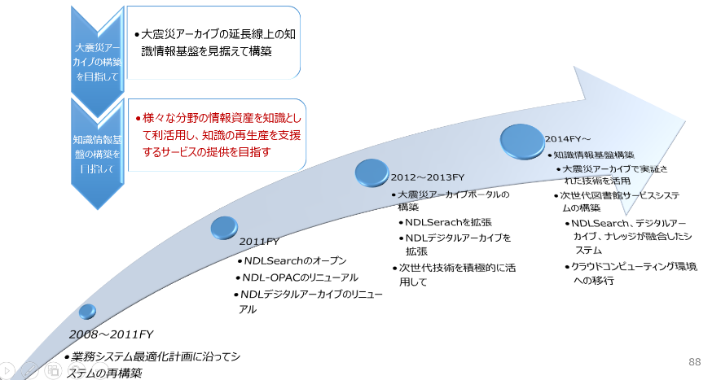
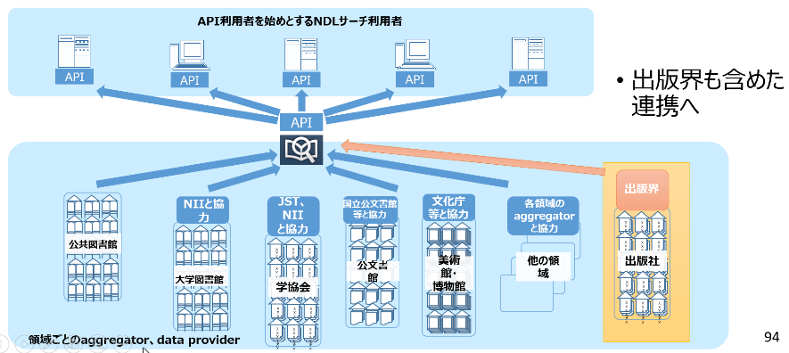
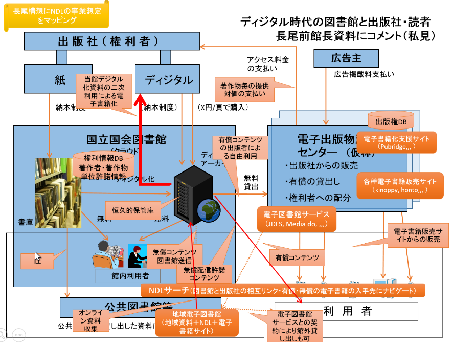
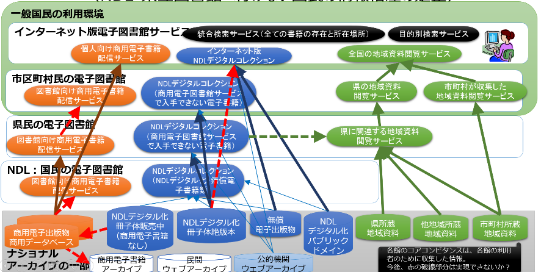
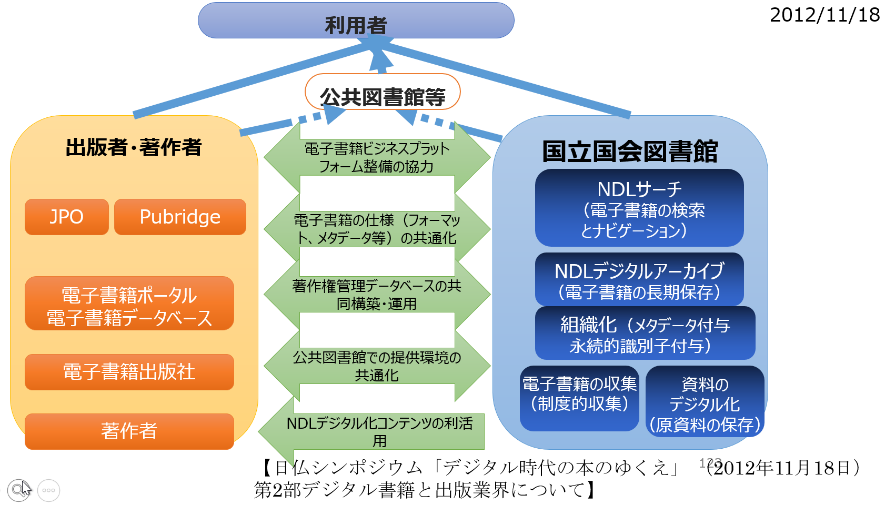
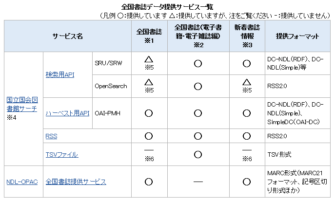
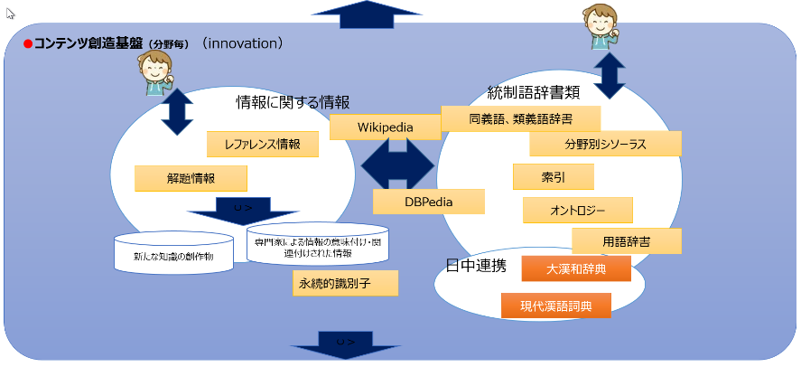

DAW23-31知識インフラとしてのナショナルアーカイブの構築を目指して　

2016年5月30日

中山正樹

ナショナルアーカイブとは
========================

知識インフラ、デジタルアーカイブ、ナショナルアーカイブとは　
------------------------------------------------------------

■デジタルアーカイブとは

一般では、情報をデジタル化して保存し利活用できる仕組み（保存だけではない）

NDLが進めてきた電子図書館事業そのもの

出版界では、長期保存するという概念はない？

出版界の「電子図書館サービス」には、図書館界でのデジタルアーカイブという概念は含まれない？

■知識インフラとは

情報資源を統合して検索・抽出することが可能な基盤の概念

目指すところは、デジタル文化資源全体のナショナルアーカイブと同じ

出版物は、知識インフラの中で、最重要視される情報。

■ナショナルアーカイブとは

国全体でデジタルアーカイブする仕組み

各機関が提供するデジタルアーカイブをあたかも1つのアーカイブとして利活用できる仕組み

知識インフラの実現形の１つ

電子書籍に絞っては、「電子書籍のナショナルアーカイブ」

文化資源全体で、「デジタル文化資源のナショナルアーカイブ」

■インターナショナルアーカイブ

各国のナショナルアーカイブをあたかも１つのアーカイブとして利活用できる仕組み

ナショナルアーカイブで何をできるようにするか
--------------------------------------------

■情報を探し出す作業の効率化・質の向上

●網羅的な情報から、利用者の属性、スキル、利用場所に応じた的確な情報を絞り込んで提示

●対話及びあいまいな条件による本文情報への的確なナビゲーション

■情報を探し出せるようにするための作業の効率化・質の向上

●主題分類単位の検索で網羅性を確保

●専門家、図書館員等のノウハウの形式知化・DB化

●可能な限り自動化

メタデータ付与、組織化、構造化、本文情報間の関連付け

■新たな知識創造のコミュニティを構築

●人と情報の関係、情報と情報の関係をリンクさせ、人と人を関連付け

ナショナルアーカイブで何が変わるか
----------------------------------

■新しい発想により、様々なイノベーションが期待できる

●有用な情報が網羅的に関連付けられて利用可能になることにより、今までは困難であった新しいサービスやビジネスが生み出される可能性がある

■国民による創造的な活動の促進

●情報を探すための工数を、創造的な活動に時間に振り向けることができる

●利用可能な限られた情報に基づいた研究から、網羅性の高い情報が利用可能になることにより、より高度な研究へシフト

●情報に紐づいた人同士のコミュニティにより創造活動が活性化する

ナショナルアーカイブと構想全体のイメージ
----------------------------------------

{width="6.2623764216972875in"
height="3.4434241032370956in"}

■今日のメインは、左下の電子書籍に関するナショナルアーカイブの構築

■その背景となるNDLでの電子図書館サービスの構築で何を考えてきたかを振り返るとともに、

■今後の国全体での文化資源のアーカイブの構築の方向性と、その中で重要なジャンルの１つである出版物・文献のナショナルアーカイブの具体的なイメージに考察します。

文化資源のアーカイブの具体的なイメージも資料には載せたが、詳細の説明は省略する

■右側の黒い部分は、ナショナルアーカイブの構築に必要な情報の在り方、人材育成、そしてシステムの開発方法論の話しであり、今回の触れない。

おまけ
------

■書誌情報とメタデータの違い

●従来は、

書誌は、冊子体資料等の書誌的事項

メタデータは、デジタル情報の書誌的事項

●最近は、合わせてメタデータと称する

デジタル情報に付与されるメタデータとしては、

管理メタデータ、記述メタデータ、保存メタデータ、権利メタデータ、技術メタデータ

■出版情報と図書館書誌情報の違い

●出版情報は、

販売促進のために版元が作成した出版物に関する情報

基本書誌に加えて、内容紹介、著者紹介、書影、（試し読み、書評リンク）がある

データ形式は、ONYX仕様、ユニーク識別子は、ISBN

●図書館書誌情報は、

TRC、トーハン、日販等のMARC会社が作成し、それをベースに図書館で独自情報を付加したもの

NDLは、出版情報をベースに、図書館目録規則に従って、書誌を加筆。著者名は典拠IDを付与

日本全国書誌として提供

データ仕様は、MARC形式、最近はダブリンコア（DC）準拠、ユニーク識別子は、NDL書誌ID

書籍分野のナショナルアーカイブ
==============================

書籍分野のナショナルアーカイブの概念モデル－出版界との役割分担－
----------------------------------------------------------------

{width="5.905555555555556in"
height="3.7111111111111112in"}

これは電子書籍分野での必要な機能を5つに分解。それぞれ、出版界と図書館界の役割分担を例示。

以前、長尾構想として示された内容と酷似。

電子書籍議連に提示。

電子書籍分野のアーカイブの機能モデル
------------------------------------

{width="5.905555555555556in"
height="3.9763888888888888in"}

これは電子書籍分野での必要な機能を5つに分解。

議員、財務省等に提示した図の元となった、出版界と図書館界の役割分担を情報と機能をデータフロー図的に表現したもの。システム屋的にはわかりやすい。

以前、長尾構想として示された内容と酷似。

**商用コンテンツは電子書籍サイトから提供**。電子書籍サイトが**アーカイブを保持できない場合、NDLの恒久保存用アーカイブを利用して電子書籍サイトから提供**。

この構想は、NDL内有志での検討をまとめたもの。館内オーソライズに至っていないが、考え方は議員、財務省等に提示。

～～～～～

電子書籍に関するナショナルアーカイブは、コンテンツの生成機能、収集・一時保管機能、保存機能、権利情報・管理情報の収集・管理機能、配信・流通機能の5つの機能を想定する（図1）。

　コンテンツの創出から収集・保存、配信・流通に至る全体の流れを一元的に集約するため、恒久保存のアーカイブと共に、ナショナルアーカイブ全体のメタデータを集約するデータベース（以下、「中央データベース」という。）においては、多様な主体が多様なデータを扱えるよう、柔軟かつ多層的なデータ構造を実現する。具体的には、著作物・著作者・出版者等の書誌情報、販売データ・販売者・所蔵機関等の所蔵情報、目次・索引・シソーラス等の情報探索情報等の多様なデータを一元的に管理可能な仕組みとする

出版界とNDLの役割分担

デジタルコンテンツの生成機能
----------------------------

{width="5.905555555555556in"
height="4.388194444444444in"}

■出版界

電子書籍化

テキスト化

EPUB化

■NDL

保存のためのデジタル化

現在はイメージ化

今後は検索のためのテキスト化

■図書館

郷土資料のデジタル化

■連携

NDLイメージ化データの二次利用提供

出版界での復刊のために

デジタル化仕様の共通化

EPUB仕様、画像・音声・動画仕様

電子書籍・書誌情報の収集機能
----------------------------

{width="5.905555555555556in" height="4.475in"}

■電子出版支援組織

販売用コンテンツの保存

ビューアに依存しないEPUB

■出版・権利情報管理組織

出版情報DBの構築

出版・出版サイト情報の提供プロトコル（API）の開放

（書誌、書影、出版情報、出版サイト情報）

■NDL

全国書誌（国内出版物の総合目録）、提供元情報の作成

出版情報・提供サイト情報の収集

書誌作成において、出版情報の活用（私見）

近刊情報、新刊情報

公的機関のウェブ情報の収集の拡大

民間無償オンライン資料収集の拡大

民間有償オンライン資料の収集（未実施）

公的機関の情報のLinked Open Data化の推進

■連携

メタデータ仕様の共通化、相互利用

メタデータ記述要素・記述規則

ONYX⇔DublinCore、MARC21

有償オンライン資料の制度化（現在協議中）

恒久的保存機能
--------------

{width="5.905555555555556in"
height="4.398611111111111in"}

■NDL

●将来に亘って利用を保証

有償・無償に関わらず著作物を、文化資産としてアーカイブし、後世に残す

●ダークアーカイブの役割を持つ

著作権、出版権、肖像権等の権利がある著作物

提供元機関が、維持・提供が困難な事態が発生した場合、提供元機関に提供

■出版界

電子書籍のバックアップサイトとして活用

■関係機関との連携

●あらゆる記憶・記録を、利活用できる形で、後世に残す

出版界も含め、他の文化資源保存機関と分担して、ナショナルアーカイブを構築

研究機関と連携して、長期保存技術の研究開発、実用化実証実験

●アーカイブ内の情報へのアクセスのための仕様の共通化

権利情報・管理情報の収集・管理機能
----------------------------------

{width="5.905555555555556in"
height="4.4527777777777775in"}

■出版界

●著作物の権利情報の収集・管理・提供

著作者情報の管理

著作権、出版権等の権利情報

●出版情報の管理

基本書誌、内容紹介、著者紹介、書影、試し読み、書評リンク、重版情報、ジャンルコード、

出版権登録情報

著作者情報、出版社情報、

著作権情報

■NDL

書誌情報、件名、NDC分類コード、著作者典拠情報の提供

■連携

ISBN、著者典拠ID等の永続的識別子による著作物同定

著作権情報の共有（私見）

配信・流通機能
--------------

{width="5.905555555555556in"
height="4.416666666666667in"}

■出版界

各電子書籍販売サイトから、インターネット利用者へ提供

商用の電子図書館サービスサイトから、公共図書館利用者へ提供

■NDL

著作権切れデジタル化資料をインターネット利用者へ提供

絶版デジタル化資料を公共図書館利用者へ提供

■連携

利用者の閲覧環境の共通化（私見）

NDLデジタル化資料の商用電子書籍ビューアでの閲覧

目録および所在情報の提供
------------------------

{width="5.905555555555556in" height="4.41875in"}

■目的

●全ての出版物の存在を可視化

利用者に対して、所在場所に関わらず、何らかの形で入手可能な著作物を網羅的に見つけ出せるようにする

●利用者の選択肢の確保

利用者が必要とする著作物と、その入手先を自由に選択できるようにする

■出版界

絶版になっている出版物も含めて網羅的に検索できるサービスの提供

販売促進

商用出版物を優先表示

■NDL

所蔵していない出版物も含めて網羅的に検索できるサービスの提供

利活用の推進

利用者が入手しやすい提供元を優先表示

■連携

利用者視点で、利用者が資料を探し出すために必要な情報を共有化

それぞれの利用者の目的に応じた検索サービスの構築を容易にする通信プロトコル、メタデータ仕様の共通化

出版界との連携による電子書籍ナショナルアーカイブの構築
======================================================

出版物に関して、出版界と図書館等で、保存と利活用の網羅性の確保

・ナショナルアーカイブの中で中核的な情報としての文献の利活用の促進

・利活用の市場の拡大による出版文化の発展を目指した連携

■今日のメインとなる部分

国としてのナショナルアーカイブのうち、出版物を中心とした情報に関して、電子書籍のナショナルアーカイブの構想が描かれた。

国立国会図書館サーチの現状（2012年1月から運用
---------------------------------------------

{width="5.905555555555556in"
height="3.4541666666666666in"}

NDLサーチの統合検索サービス提供における連携イメージ
---------------------------------------------------

{width="5.905555555555556in"
height="2.4430555555555555in"}

他の領域は、領域ごとのaggregator（候補）との協力関係により連携拡張

公共図書館は、NDLが直接連携

メタデータの流通において、NDLサーチが果たす役割
-----------------------------------------------

{width="5.905555555555556in"
height="2.6194444444444445in"}

アグリゲータのメタデータを集約し、様々な機関へAPIにより提供。NDLサーチはハブ的な役割。

出版情報を含めた統合検索（現状）
--------------------------------

{width="5.905555555555556in" height="3.38125in"}

出版情報を含めた統合検索（現状）

青がメタデータを収集もしくは横断検索で統合検索

オレンジが、リンクリゾルバで、検索結果から入手先へのナビゲーション

出版情報を含めた統合検索（私見）
--------------------------------

{width="5.905555555555556in"
height="2.9944444444444445in"}

出版界

版元ドットコムはこれからの出版関連情報提供の先行事例

出版界内での情報の共有の仕組みと、図書館等の他の仕組みとの具体的な連携を調整する時期に来ている

改めて、NDLサーチが果たす役割
-----------------------------

{width="5.905555555555556in" height="2.64375in"}

アグリゲータのメタデータを集約し、様々な機関へAPIにより提供。NDLサーチはハブ的な役割。

ディジタル時代の図書館と出版社・読者長尾前館長資料にコメント（私見）
--------------------------------------------------------------------

{width="5.905555555555556in" height="4.475in"}

ディジタル時代の図書館と出版社・読者　長尾前館長資料にコメント（私見）

これに今進めているNDL等の事業をマッピングしてみた

ほとんどが、はまる

今後の方向性
------------

### 資料デジタル化の社会的意義

{width="5.905555555555556in"
height="3.904166666666667in"}

改めて、資料デジタル化の社会的意義

国民共有の情報資源の保存と利用の両立

デジタル時代の人びとの利便性の向上

情報格差の解消－だれでも、いつでも、どこからでも－

日本の出版文化の発信

出版文化の隆盛に資する

⇒

これらは、国全体として取り組む

「ナショナルアーカイブ」構築に関連

づけられ、社会的意義が増すことになる

### 「ナショナルアーカイブ」構築に向けて

{width="5.905555555555556in"
height="2.4243055555555557in"}

2014年４月の著作権法の一部を改正する法律案に対する国会の附帯決議において、「ナショナル・アーカイブが、図書を始めとする我が国の貴重な文化関係資料を次世代に継承し、その活用を図る上で重要な役割を果たすもの」であるとした上で、「その構築に向けて、国立国会図書館を始めとする関係機関と連携・協力」して取組を推進することとされている。

（以上、27年度予算想定問答より）

### デジタルアーカイブ促進のために

{width="5.905555555555556in"
height="2.573611111111111in"}

・今年の裁定制度の見直しは、運用面でもかなり改善がなされた。

・当館を含む公的機関の裁定について、第三者が裁定申請する根拠としてより簡易に活用できるようにしてほしい。また、裁定結果を共有できるデータベースの提供、権利情報管理組織が実効性のあるものとなるとよい。

・著作権法第31条第1項及び第3項の「図書館等」に外国の類似の制度による施設への拡張が望まれている。海外への日本のPRにもなる。

・視覚障害者等の情報享受「以外」の利用について。検索のためのテキスト化及び検索結果表示のための最小限のテキスト化データ提供を第47条の６（送信可視化された情報の送信元識別符号の検索等のための複製等）と同様に簡便に実施できるようになるとよい。

・各図書館で、当館が所蔵していない貴重資料・地域資料をもっている。それらの図書館でのデジタル化が進むような方策ができるとよい。

予算が厳しい折、全国レベルで効率的なデジタルアーカイブの構築が勧められるとよい。

・最終的には、当館が所蔵しているがデジタル化が未だのものも含めて、当館でそれらの複製物（デジタル化データ）を利用できるようになるとありがたい。その際、各図書館等がこれからデジタル化するものだけでなく、既にデジタル化している資料も含めて、当館が収集し、長期保存していくことができると、当館の使命も果たせる。

・各図書館のデジタル化データのうち、絶版等資料については、デジタル化を実施した各図書館から配信できるようになることも望まれる。だが、配信システムまで用意できるところはあまりないだろうから、当館から配信することもできるようになるとよい。

出版物関連での問題提起と課題解決に当たっての私の意識
====================================================

【背景】私が目指してきた電子図書館１
------------------------------------

■目的

文化的資産をあらゆる人々が将来にわたり享受、活用できるようにし、人々の創造的な活用に貢献する

■背景

デジタル情報時代において、マルチメディア化されたコンテンツへ移行しつつある。

冊子体の原資料は文化財として保存するために、デジタル化を進めることとしている

また、他の文化財も保有機関においてデジタル化を進めるようになった

■利活用の促進のために

社会全体でデジタル情報資源の「見える化」はもとより、

より効率的なアクセスの保障に取り組む必要があり、組織を越えたナショナルアーカイブは重要な役割を果たす。

産学官のそれぞれの組織は、これらの施策が同一の方向性を持って、相互に資源を補完し合っていく必要がある。

NDLは、ナショナルアーカイブの構築、さらに、世界レベルでの「インターナショナルアーカイブ」の構築へと発展することを目指し、その中核的な役割を担っていくべき。

■同時に、今後10年のデジタル情報化の進展を見据えつつ、

このようなナショナルアーカイブを利用して知識創造のための情報が入手できる状況になったときに、知識創造を支援する図書館の役割は何か、

重要な役割を果たす著作物の利活用が進むようにするために、出版界、図書館界は、総論賛成・各論反対ではなく、連携協力を具体的進める必要がある

■知識インフラとしてのナショナルアーカイブ構築により、出版文化の発展を目指す

著作権者、出版社の権利を制限してアーカイブするものでなく、知識インフラとしてのナショナルアーカイブ構築の一環として、出版文化の発展を目指して、出版物の利活用が促進される施策を推進することと考える

■出版文化の発展に向けた具体的なアクション

●出版界、図書館界の事業の実施においては、最終的な大きな枠組みの中で、整合性を持って効率的に組み込まれることを常に意識する。

●著作物の網羅的な検索と、利用者に最適な形態の情報へのナビゲーション

紙・デジタル、有償・無償を問わず、所蔵機関に寄らず、情報の所在を可視化し、いつでも、どこにいても、利用のシチュエーションにあった形態の情報の入手先にナビゲートする

検索は、図書館書誌情報のみならず、出版情報、著作単位、章節項単位の目次、まえがき、あとがき、であれば本文全文を。

情報と情報の内容を意味的に関連付けて、芋づる的に、必要な情報へたどり着けるようにする

●公共的書誌情報基盤の構築

出版情報と図書館書誌情報の相互交換（ONIX←→DC←→MARC）

JPO近刊図書情報の提供、NDL納本資料の書誌情報をインプロセス段階から提供

●電子書籍フォーマットの業界標準策定支援（EPUBサブセット仕様等）

「電子書籍の標準化の調査」JEPAに委託（2010年2月）

出版社、古書店、電子書籍、商用データベースサイトとの連携、ナビゲーション

統合検索：hon.jpとの相互連携, JapanKnowLedge, 近刊情報センター,
インターネットマガジン（インプレスR&D）, 新書マップ,
日本ペンクラブ文芸館、

検索結果からのナビゲーション（リンクリゾルバ）：Amazon、Books.or.jp,
honto, 紀伊国屋書店BookWeb, ジュンク堂書店, Honya\_Club.com, e-hon,
版元ドットコム, 日本の古本屋, Boogle Book Search, Google Scholar

●各機関のデジタルアーカイブのバックアップサイト（商用に関しては未実施）

国等の機関のインターネット情報の収集保存

民間の無償オンライン資料の収集保存

残るは、有償オンライン資料の収集保存（有償の資料はすぐに消滅しないと思われる）

【問題提起】一般国民の情報へのアクセスを保証（NDL・県立図書館へ行けない国民の情報格差の是正）
---------------------------------------------------------------------------------------------

{width="5.905555555555556in"
height="2.972916666666667in"}

■各図書館の位置づけ

●市町村立図書館は、市町村民のための図書館

市町村立図書館は、国民にとって最も身近なアクセスポイント

市町村民への直接サービス

市町村で収集した情報に加えて、県立図書館、NDLが保有している情報を提供

●県立図書館は、県民のための図書館

県民への直接サービス

県が収集した情報に加えて、NDLが保有している情報を提供

市町村立図書館を経由した情報提供

●国立国会図書館は、国民、議員のための図書館

国民への直接サービスとして、インターネットでの情報提供

間接サービスとして、県立図書館を経由した情報提供

全国書誌を提供する役割として、NDLが収集した出版物のみならず、全ての刊行物の存在と所在場所を提供する

■商用電子図書館サービスの位置づけ

商用電子書籍を、県立等の図書館へ配信し、各図書館が自ら保有する情報と合わせて、各図書館の利用者へ提供

■検討の観点

●提供は、フローとして

NDLが自ら保有している情報に加えて、他組織の情報を補完的に提供するのではなく、

最も身近な市町村立図書館が、自ら保有する情報に加えて、県立、NDLが提供する電子図書サービスを合わせて利用できるようにする

NDLは、市場で流通せず、県立、市町村立図書館でも所蔵していない書籍を、提供する責務がある

●収集・保存は、ストックとして

市町村立図書館が収集した情報を、県立図書館が収集。県立図書館が収集した情報を、NDLが収集

一般国民の情報へのアクセスを保証　補足説明
------------------------------------------

■各図書館の位置づけ

-   市町村立図書館は、市町村民のための図書館

    -   市町村立図書館は、国民にとって最も身近なアクセスポイント

    -   市町村民への直接サービス

    -   市町村で収集した情報に加えて、県立図書館、NDLが保有している情報を提供

-   県立図書館は、県民のための図書館

    -   県民への直接サービス

    -   県が収集した情報に加えて、NDLが保有している情報を提供

    -   市町村立図書館を経由した情報提供

-   国立国会図書館は、国民、議員のための図書館

    -   国民への直接サービスとして、インターネットでの情報提供

    -   間接サービスとして、県立図書館を経由した情報提供

    -   全国書誌を提供する役割として、NDLが収集した出版物のみならず、全ての刊行物の存在と所在場所を提供する

> ■商用電子図書館サービスの位置づけ

-   商用電子書籍を、県立等の図書館へ配信し、各図書館が自ら保有する情報と合わせて、各図書館の利用者へ提供

> ■検討の観点

-   提供は、フローとして

    -   NDLが自ら保有している情報に加えて、他組織の情報を補完的に提供するのではなく、

    -   最も身近な市町村立図書館が、自ら保有する情報に加えて、県立、NDLが提供する電子図書サービスを合わせて利用できるようにする

    -   NDLは、市場で流通せず、県立、市町村立図書館でも所蔵していない書籍を、提供する責務がある

-   収集・保存は、ストックとして

    -   市町村立図書館が収集した情報を、県立図書館が収集。県立図書館が収集した情報を、NDLが収集

課題提起
--------

■理念

権利（権限）を持つものは、実施の責任と義務がある

■出版界

電子出版権は、出版社の権利ではあるが、それは、利用者に対して、電子出版の義務でもあるのではないか？

NDLがデジタル化資料のうち、絶版になっている資料の公開範囲を広げられないか？

■NDL

ストックとして、将来の利用を保証するために、国民には国内刊行物を納本義務があり、また、NDLは網羅的に収集して保存する責任と義務があるが、単独では不可能

フローとして、現在の利用者に対しての利用の保証は、すでに各機関で分担してビジネスモデルがある

■市区町村立図書館（地域住民サービス、地域活性化の拠点）

新刊書の充実より、身近な図書館として、ITを活用して、様々な情報を得られる場の充実

■県立図書館

市区町村図書館での電子図書館サービスの導入支援

問題提起（詳細）
----------------

■理念

権利（権限）を持つものは、実施の責任と義務がある

活用されるべき知的情報資源の中で、出版物は、重要な情報源の１つ

地域においても、中央と同様の利活用する権利がある

出版文化が発展するということは、より多くの人が書籍に触れ、市場（マーケット）が拡大していくことでは

■出版界は

●様々な情報がインターネットで得られる時代に、書籍を購入する動機づけが必要ではないか？

SNS、OpenDataで相当信頼性の高い情報が、インターネット上で関連付けられて得られる時代

●出版権は、出版社の権利ではあるが、それは、利用者に対して、電子出版の義務でもあるのではないか？

●NDLは、1968年以前の書籍、2000年以前の雑誌のデジタル化を進めてきた。従来ILLで公共図書館に貸出すことが可能だった資料も、デジタル化により提供できなくなった。

絶版資料は、デジタル化した資料を公共図書館でも閲覧できるが、絶版になっていない資料はデジタル化資料も公共図書館で利用できない。

出版社が電子出版権を行使して電子書籍化することが望まれる。コスト削減のために、NDLがスキャンしたデジタルコンテンツを出版社が二次利用することも可能。

絶版になっていない資料で電子出版権が行使されないならば、何らかの対応が必要。

●NDLがデジタル化資料のうち、絶版になっている資料の公開範囲を広げられないか？

せめて、NDLがデジタル化資料のうち、書籍が絶版になって、電子出版権行使されていない資料は、公共図書館に留まらず、インターネット公開しても、著作権者や出版社の不利益にならないのではないか？

■NDLは

●あらゆる知的情報資源を、将来にわたって利用、享受できるようにし、知的創造活動（知識の再生産）に貢献する使命を持つ

●具体的な方策の1つとして、法律により、国民には国内刊行物を納本義務があり、また、NDLは網羅的に収集して保存する権限をもつ

★責任として、可能な範囲を収集・保存できればいいのではない。物としての出版物は、図書館に限らず、美術館、博物館でも多く保存されている。

★電子書籍・電子雑誌に類するものは、１つの機関で収集できる範囲を越える。

★十分な資源がない中で、責任と義務を果たすためには、関係機関との連携分担して保存し、それらを国全体で網羅的に収集・保存することが必要

●ストックに関して、利用環境やビューアに依存しないものであるべきでは

★知的情報資源のストックとして、従来、有形物として収集してきたが、今やデジタル化された無形の情報として流通しているものを収集・保存することが求められている

★それは、利用環境やビューアに依存しないものであるべきではないか？

●利用に関しては、商用電子図書館サービスと契約し提供していくべきでは

★商用データベースや電子ジャーナルを契約により、それぞれのビューアで提供していることから、電子書籍は、商用電子図書館サービスと契約して、そのビューアを利用して提供していくことが妥当ではないか？

●公共図書館への支援と連携

★支援という観点だけでなく、公共図書館の協力の下で使命の達成を目指す施策

★電子図書館は、情報の利活用の促進だけでなく、地域格差を是正する目的もある。

★地域においても、可能な限り、中央と同等の情報を利活用できるようにする責任と義務がある

■身近な公共図書館（地域住民サービス、地域活性化の拠点）

●ITを活用して、様々な情報を得られる場の充実

★蔵書は所蔵資料だけでなく、NDLや県立図書館、他地域が保有する地域資料を含めて、仮想的な蔵書として、利用できるようにすることが、重要

●「人と人のつながりの場」としての役割の充実

★人が集い、交流し、学び、議論する場（インテクレチュアルコモンズ）を構築し、知識の共有と、新しいものを生み出す活動を応援する

★コラーニング（学びあい、知識の交流）、フィーチャーセンター（対話、議論、問題解決、未来志向）

活動の成果をアーカイブし、インターネットで世界へ発信

・地域活動のための情報収集（蔵書等の活用）⇒共有・蓄積⇒活用・創造⇒オープンデータとして発信

・Wikipedia Town, アイデアソン, ハッカソン,

ししょまろはん（京都府立図書館の司書の活動）

京都が出てくる小説やマンガ・ライトノベル等の作品に出てくる京都の位置データに加え、書籍のおススメ度や内容紹介付き。

（引用：「インテクレチュアルコモンズがひらく」公共図書館等文化施設の未来）～京都府立図書館がパラダイムシフトする時～是住久美子）

★知識として活用する資料・情報は、新刊ではなく、外部サービスを含めて、利用可能な豊富な蔵書では？

●地域資料の充実、地域情報の集約

★地域資料を蔵書として収集するだけでなく、他地域で保有している、当該地域に関する資料を利用できるようんすることが重要では？

●地域住民サービスとして、図書館利用の中で、個人でも入手可能な新刊図書に資料購入費を充てることから脱却する必要があるのではないか？

■県立図書館

●市区町村図書館で、個別に電子図書館サービスを導入することは困難

●県単位での推進、導入し、市区町村の公共図書館で利用できるようにできないか？

■文書館、美術館、博物館等

●図書館と同様の活動に加えて

●来館者に対して、外部情報提供サービスを活用して、所蔵物と参考情報の関連付け、所蔵していな物の情報を提供

出版界・図書館界での課題解決に当たっての私の意識
------------------------------------------------

■事業の目標

●様々な分野のあらゆる記録を情報として集約して、相互に関連付けて知識化し、将来にわたって利用を保証して、「社会・経済的な価値を創出」できる「新たな知識の創造と還流」の仕組みを構築する

★「私たちの使命」、「知識インフラの構築」、「知識情報基盤」、「知の共有化」、「国としての蔵書構築」、「ナショナルアーカイブ」、「新たな知識の創造と還流」、、、の方向性は同じか？

■課題解決にあたっての姿勢

●電子図書館中期計画2004の達成

★国全体で、「電子図書館構想」を実現

★NDLは、データプロバイダとしての位置づけ、「知の共有化」のための連携のインキュベータとしての役割

●事業継続計画の観点

★法律により当館に与えられた「権限」には、「実施の責任と義務」がある。

★その義務を果たしてきた実績に裏打ちされて、当館への新たな期待も寄せられている。

★その期待に応えなければ、国会・国民から「権限は持っているが、責任と義務を果たさない組織」として存立意義を疑われる事態になりかねない。

■資源の確保

●緊縮財政の中で、如何にして、利用可能な資源を確保し、事業を継続していくか

■世界の中の日本、日本の中のOneOfThem？

●世界規模での文化的な情報資源、知識の共有化の方向性の中で当館の位置づけは？中核的な役割を果たすのか、OneOfThemとして一翼を担うのか？

■サービス向上、業務・システムの効率化に資するIT関連の新しいソリューションをどのように取り込むか？

① クラウドソーシング、② BYOD (Bring your own device)、③ ビッグデータ、④
セマンティックウェブ技術、⑤ サービスのマッシュアップ、⑥ ERP、⑦Digital
Transformation、、、

■デジタル情報時代を踏まえた基本的な考え方

●物の収集から情報（コンテンツ）の収集へ。

●保存は物理媒体、利用は情報（コンテンツ）

●図書館は本を集めて提供する組織から、コンテンツを集約して、コンテンツ同士を関連付けて知識として提供する機関へ

■図書館の実施姿勢

●今までNDL単独でやれることをやれる範囲でコツコツとやってきたのではないか？

●創造力を駆使して、大局観で課題に取り組んできたか？

●新たな事業展開にあたってのリスクの許容レベルは？リスクを恐れて、大きく踏み出せなかったのではないか？

■MLA連携

●国としてのアーカイブ構築事業の枠組みの中で、MLA、MALUI、GLAM等との連携協力を推進する

■出版界との連携の推進

●読書機会の拡大による出版文化の発展を目指して、出版物、電子書籍等の販売拡大に直接繋がる形で出版界を支援。共存共栄の観点で出版界を補完したサービスを提供する

●長期的な展望での出版文化の発展につながる施策と、短期的に出版界の利益になることを選択的に行う。

★例えば、JDLSのサービス構築への助言（NDLデジタルコレクションの統合検索、閲覧環境の共通化）

出版情報と図書館書誌情報の相互交換（ONIX←→DC←→MARC）

★電子書籍フォーマットの業界標準策定支援（EPUBサブセット仕様等）

★当館デジタル化資料を活用した電子書籍作成、配信

●電子書籍自動作成システムの構築（現在、個別技術調査研究中）

★イメージ画像→ページ切出し→テキスト化→構造化→標準EPUB→テキストDAISY、リフロー型EPUB、PDF（フィックス型EPUB）→配信

●出版社、古書店、電子書籍、商用データベースサイトへのナビゲーション

★利用者視点で、商用サイトとの積極的な連携と、サイト内情報へのナビゲーションの拡大

出版界と図書館界の役割分担と連携協力
------------------------------------

{width="5.905555555555556in"
height="3.370833333333333in"}

2012年10月（3年前）、フランス国立図書館（BnF）のラシーヌ館長を招いた日仏シンポジウム「デジタル時代における本のゆくえ」でプレゼンした資料。あくまで私案。

～～～～～

電子書籍ビジネスにおけるNDLの役割を改めて考えるとすれば、それは「電子書籍の普及によって読者人口が増え、出版全体の市場が拡大して、出版ビジネスが加速されていく」という流れを支援することだと思います。その背景には、資料や情報などの文化的資産を長期保存し、その利用を将来にわたって保障する、つまり利用者にとってはラストリゾート（最後のよりどころ）、提供者にとってはダークアーカイブとなるという、NDLの役割があるわけです。私たちはそのいずれにおいても関係機関と連携しながら、今後さらに対応を進めていきたいと思います。

～～～～～～～～～～～～～～～

連携先として、最重要な出版界との連携協力の案です。私案の提案段階であり、具体的な調整はまだ進んでいません。

電子書籍は，印刷出版物の延長にあるものであり、文化的資産の１つの形態である．

現在，電子書籍出版は，ビジネスとして立ち上がろうとしている．NDLは，電子書籍によって読者人口が増えて，**出版全体の市場が拡大し，出版ビジネスが加速されるように支援する**とともに，電子書籍をの将来に亘るって利用を保証することが役割と考える．そのためにも，民間の市場経済活動を阻害することなく，**市場拡大のために，出版界と下記のような様々な連携協力を検討している**が今後の課題である．

・電子書籍ビジネスのプラットフォーム整備への協力

収集・組織化・保存・提供のモデルで、電子出版社とNDLが連携したサービス、システムモデルの構築と相互利用

電子書籍サイトの統合検索、サイトへのナビゲーション

・電子書籍フォーマットの共通化

ONYX、MARC、DC（ダブリンコア）

EPUB、 PDF等のフォーマット、ビューア、DRM

*電子書籍フォーマットの国際標準，業界標準の策定を支援して，共通フォーマットの普及を促進させたい．*

・出版情報と書誌情報の連携

JPOの出版情報を活用して、利用者に近刊図書を公知するとともに、それを活用して書誌を作成する。\
また、印刷刊行物を利用して電子書籍出版をする場合の書誌的事項として、当館の書誌情報の活用を推進する。\
そのために、出版情報と書誌情報の相互運用ができるように、書誌調整を行う。

・著作権管理センターの構築・運用の協力

*今後、NDLでの資料のデジタル化状況，出版社でまだ電子書籍化されていない資料の著作権状況など，出版界とNDLで協力して，著作権管理データベースを構築すべきと考える．*

公共図書館への送信条件の1つの「絶版本であること（市場で電子書籍として流通していない）」の調査と、出版界での電子書籍化において、まだ電子書籍化していない書籍のリストは、目的は違っていても、リストとしてはほぼ同様のもの。協力して構築できるのではないか。

・公共図書館での利用環境の共通化

*今後，電子書籍が，公共図書館等でも電子書籍サイトからそれぞれのビューアを利用する形で提供されることが予想される．NDLからの提供は，別の著作権保護方式で別のビューアを利用する形では，利用者にとって利便性が悪い．電子書籍サイトとNDLとで，共通の著作権保護機能とビューアで提供できるように，公共図書館での電子書籍閲覧環境，コンテンツ配信システムの共通化を図っていくことが，市場の拡大に繋がると考える．*

・NDLデジタル化コンテンツの二次利用の促進

*国のオープンガバナンスの方向性に沿って，NDL保有の資産で，第三者の権利を侵害しないものは，積極的に二次利用を促進させたい．原出版社に，画像データをとして提供し，二次利用によって，電子書籍を作成してビジネスが行えるように支援することも想定する*

・電子書籍サイト等，商用サイトへの案内の強化

*NDLサーチは，紙・デジタル，有償・無償，商用サイト・公的機関等に関わらず，ロングテールで容易に資料の存在を確認することを目的としている．利用者が最も迅速に入手し閲覧可能な入手先へ利用者をナビゲートすることが目的である．NDLは今後利用者の資料の有力な入手手段となる電子書籍サイト等への案内を強化することを想定している．*

・電子書籍に対する永続的識別子の付与

*出版に先立って販売促進のために作られた出版前情報，出版情報は，NDLで蔵書として管理するための書誌情報には活用されておらず，また関連付けもされていない．出版情報はONIXで，書誌情報はMARCで，電子情報はDCベースでというように，書誌的事項の記述規則も共通化されず，再利用もされていない*

*著者が作品を作成した時点で，永続的識別子を付与し，販売のために作成された出版情報と，図書館での書誌情報をリンクさせる形で相互連携できるようにしていきたい．また，実際に永続的識別子を付与する手段として，JaLCを活用したDOI付与も想定している．*

出版界と図書館界は、どんな役割を分担して連携していくべきか？
------------------------------------------------------------

様々な情報が溢れている中で、出版物に対するマインドシェアが高まるように、利用者視点で。

■出版界

●電子出版権を持つ書籍の電子書籍化の推進

★商用電子書籍配信サイト、ビューアに依存しない電子書籍（利用者がビューアを自由に選択できるように）

●出版情報（メタデータ）の充実（著作物の見える化）

★タイトル、著者名、出版社、出版年、件名、ISBN、NDC等のほかに

★内容紹介、著者紹介、書影、試し読み、書評、章節項単位の目次、まえがき、あとがき、であれば本文全文。特に書評は購入時の参考になる

●県域の市区町村を含めて、県単位での商用電子図書館サービスの提供の推進

■図書館界

●出版物（冊子体、デジタル）のバックアップ（永久保存、ディザスタリカバリ）

●出版社が電子書籍化しない書籍のデジタル化

●書籍・電子書籍販売サイト、全国の図書館の所蔵資料の統合検索サービスの提供（著作物の見える化）

★他の文化資産の合わせて

●出版物に関する情報の充実

★図書館蔵書に限らない典拠情報の充実

★出典を明らかにしたレファレンス情報の充実

■連携

●電子書籍ビジネスプラットフォーム整備の協力

★出版物（冊子体、デジタル）のメタデータデータベースの共同構築

★出版権を含む権利データベースの共同構築（著作単位、著者単位）

●電子書籍化に際し、NDLがデジタル化したデータの利活用（二次利用提供）

●電子書籍の仕様（フォーマット、メタデータ記述要素・記述規則等）の共通化

●公共図書館での電子書籍利用環境の共通化（商用電子書籍ビューア上での図書館デジタル化資料の閲覧）

まとめ（改めて課題提起）
------------------------

Q:他と一緒に検索できても出版社・図書館利用者にメリットはない？

お得意さまだけ？自社で販売している、図書館が持っていることが分かっている人だけに、個別の検索、販売・貸出ができればいいの？

読者層が減っている状況で、パイの奪い合いでいいの？

A:⇒パイを大きくすることが重要では？

資料を探している利用者にとって、網羅性の高いサービスを利用する。

重要なのは、どこで提供しているかではなく、必要な情報が探し出せることでは？

利用者は、見つかった資料で、形態、価格、入手手段として、最適なものを選択する

個別サービスでは見つからなかったものが、見つかれば、また利用する⇒パイが大きくなる

⇒改めて利用者視点でのサービスが必要

他と一緒に検索されては、利用者が他に流れてしまう？

利用者に価値があると思えば、それを入手する

他と一緒に検索されないことで、優位性を確保するビジネスは、いつか崩壊する

インターネット上に有用な情報はあふれている

有償コンテンツ、有償サービスであり続けるためには？

クラウドソーシング、政府情報など、無償で有用なコンテンツはいっぱい。それらはLOD化によって、更に付加価値が高まっている

Wikipedia、オープンデータ、

国の施策ではうまく行かない？

出版情報はなぜ図書館の書誌情報として利用しない？

十進分類は誰のために付与する？

全てのISBNはどこで把握？

書影はなぜ利用制限？

### デジタル情報の収集と提供の考え方（私見）

-   基本理念

    -   国として

        -   国全体で、あらゆる資料や情報などを国の文化的資産として後世に残し、知識インフラとして、その利用を将来にわたって保証する

    -   NDLとして、

        -   知識インフラの実現の一翼を担う

    -   公共図書館として、

        -   「すべての国民は，いつでもその必要とする資料を入手し利用する権利を有する」

        -   「すべての国民は，図書館利用に公平な権利をもっており，人種，信条，性別，年齢やそのおかれている条件等によっていかなる差別もあってはならない」

-   物としての冊子体とデジタル情報の違い

    -   物は、提供するために購入（納本代償金）

    -   情報は、利用するための使用許諾料

-   実現に当たって

    -   収集・保存

        -   商用を含めて、全ての資料、情報を収集し、利活用できる形で永久保存する

            -   肖像権等は制限

    -   提供

        -   提供に当たっては、著作権者、出版者等の権利を侵害しない形で提供する。

            -   商用サービスへの対価の支払い

            -   著作権、出版権

### 商用電子出版物に関して（私見）

-   電子出版物は、無償で収集・保存

    -   商用・非商用に関わらず、DRMの付与されていないデジタル情報を、無償で、制度収集する（収集義務の行使）

        -   国が権利者に代わって、保存する役割

        -   国は、権利者に保存にかかる費用の負担を、権利者に求めない。

            -   保存にかかる費用は、国が負担する

-   商用で提供中の電子出版物の利用には、対価を支払い提供

    -   国がデジタル化した情報、国が収集・保存した情報のアーカイブを、出版社が利用して、商用電子出版物配信サービスができるようにする

        -   電子出版権が登録されていない場合は、著作権者が提供できる

    -   NDLを含め公共図書館は、利用に関しては、商用電子出版物配信サービスに対価を支払う

        -   図書館は、物としての購入ではなく、デジタル情報としての電子出版物配信サービスに使用許諾料を支払い利用する

-   商用提供されなくなった電子出版物は、国が収集・保存したデジタル情報を提供

    -   電子出版物配信サービスから提供されなくなった場合、著作権者、図書館は、国が収集・保存したデジタル情報を提供できる

        -   電子出版物配信サービスシステムがダウン

        -   著作権者、出版者の提供許諾があるもの

    -   また著作権等の権利が消滅した場合は、誰でも、利用者に対して、国が収集・保存したデジタル情報を提供できる

        -   著作権満了

-   前提

    -   図書館が利用できる電子出版物配信サービスがあること。図書館が競争原理で、網羅性の高い電子出版配信システムを自由に選択できること。

        -   利用者に対して、同分野の出版物の取り扱いの範囲が異なるため、ビューアの異なる複数の個別出版社の配信サービスの利用を強いるのは、利用者に不利益になる

            -   電子出版物配信システムの外部APIの共通化が必要

            -   複数の電子出版物配信サービスを導入することは困難。商用出版物のアグリゲータ的なサービスが必要

    -   利用の対価は誰が支払うか？

        -   使用許諾料を誰が負担するか？

            -   通常は、利用者が負担。図書館は、利用者に代わって負担

            -   商用電子書籍もその原則を守るか、見直すかは、今後の議論による

        -   利用者が負担する？

            -   ⇒個人が利用する通常の電子書籍サイトでの期間限定提供サービス、サブスクリプションサービスでいいのではないか

        -   公共図書館が負担する？

            -   ⇒図書館向け電子出版物配信サービスとの契約条件による

    -   著作権の位置づけの見直しも（長尾前館長）

        -   著作権を許諾権から報酬請求権に変えるという考え方

### 電子図書館のあり方の論点（まとめ）

-   電子図書館の目的

    -   ⇒「知の共有化」により、新たな知識の創造（再生産）と還流を推進する

    -   ⇒社会・経済的な価値の創出

        -   いつでも、どこでも、だれでも、文化的情報資源を利活用して、新たな知識が生み出されるように

    -   あらゆる情報を、知的文化資源として収集し、長期保存し、将来にわたって利用を保証する

-   貴重な文献資料は今、必要とする人に届いているか？

    -   有用な文献等の情報が、インターネット上の大量の情報の海に埋もれていないか？

        -   出版界と図書館界の書誌の統合、記述規則の共通化

        -   利用者に対して、情報の内容、所在を可視化

    -   情報を探し出すために、多くの工数をかけているのではないか？

        -   内容情報の活用、全文プルテキストの活用

        -   利用者が必要とする情報を、効率的に選択できるように、参考情報を関連付け

    -   市区町村の図書館利用者、インターネット利用者が出版物による情報の弱者になっていないか？

        -   地域でのアクセスポイントで、利用者が利活用可能な情報の格差を是正。

-   将来の利用者に届けられるか？

    -   ⇒将来の利用者のために消えてしまう前に、関係機関で分担して保存

-   この課題を解決するために具体的なアクションを。

    -   利用者が著作物に触れる機会を増やす

    -   情報の利活用が促進されることにより、文化の発展に寄与する

    -   文献に関してのナショナルアーカイブ構築を、図書館界と出版界が連携分担

    -   あらゆる知的情報資源に関して、業種・業態を越えて連携

公共的書誌情報基盤
==================

・出版界が作成する出版情報（販売促進情報）を活用した書誌作成の省力化

・共通識別子による出版界と図書館界のLinkd Data化

公共的書誌情報基盤の整備（2010年）
----------------------------------

■目的

・NDLが、出版関係機関と協力し、我が国を代表する*標準的な書誌情報を作成・提供する公共的基盤を整備*するものである。

・出版文化の基礎となる質の高い出版・書誌情報が、無償もしくは廉価にて、*迅速またタイムリーに読者、利用者に届けられることを目的*とする。*（各機関が書誌作成をする際には提供できているように）*

・また、この事業により「文化財の蓄積及びその理由に資するため」(国立国会図書館法第25条)による国立国会図書館の納本事務が、より網羅的かつ円滑に行われることとする。

■近刊情報

・ISBNとNDL書誌IDが関連付けられるよう

・出版社→JPO（ONYX）→NDL（JPNO,
書誌ID付与、近刊情報として公開）→JPO（近刊情報）→取次

■新刊情報

・取次（JPO近刊情報と現物を突合、出版情報追記して、新刊情報に）→NDL（近刊情報を置換え、最低限の書誌事項を追記して新刊情報として公開）

書誌情報の早期および多様な形態での提供
--------------------------------------

{width="5.905555555555556in" height="3.55in"}

■出版前情報の活用近刊図書情報の提供開始、書誌情報のRDF出力機能リリースのお知らせ（2012年2月2日）

[*http://iss.ndl.go.jp/information/2012/02/2\_release/*](http://iss.ndl.go.jp/information/2012/02/2_release/)新着書誌情報、作成完了書誌に加え、近刊図書の書誌情報もDC-NDL(RDF)形式でダウンロード可能

■納品データの活用

NDL-OPACで新着書誌情報のリストを提供します

（NDL書誌情報ニュースレター2012年4号(通号23号)）

[*http://www.ndl.go.jp/jp/data/bib\_newsletter/2012\_4/article\_09.html*](http://www.ndl.go.jp/jp/data/bib_newsletter/2012_4/article_09.html)

■全国書誌データ提供

デジタル情報も

インターネット情報から切り出したオンライン資料、制度収集した無償オンライン資料のみ⇒利用者は？

[*http://www.ndl.go.jp/jp/data/data\_service/jnb/index.html*](http://www.ndl.go.jp/jp/data/data_service/jnb/index.html)

全国書誌情報の利活用で超党派勉強会設置（活字文化議員連盟　2015.09.9）
---------------------------------------------------------------------

{width="5.905555555555556in" height="2.9625in"}

国としての施策の１つ

-   e-Japan戦略、知財計画、、、

-   知的財産政策ビジョン

-   電子書籍議連、デジタル文化資源議連

-   活字文化議員連盟

-   全国書誌情報の利活用で超党派勉強会

～～～～

概要

図書館などで広く活用されているMARCのもととなる書誌データを国民が無料で利用できるように政策や予算なども含め総合的な施策を検討する

超党派議員をはじめ国立国会図書館館長、日本図書館協会理事長などによる「全国書誌情報の利活用に関する勉強会」を発足

合わせて「全国書誌情報の利活用に関する実務者会議」の設置

背景

活字文化議員連盟は２０１０年に採択した活動計画

「文字・活字文化の記録を保存し、国民がいつの時代にも活用できるようわが国を代表する書誌データの一元化に努める」

その一方で、国立国会図書館が作成する書誌データは、民間の書誌データを活用することで迅速な提供に向けて取り組んでいるが、民間の提供スピードには及ばず、公共図書館などでの利活用が進まない現状がある

「全国書誌情報の利活用に関する勉強会」構成

▽会長＝細田博之（衆院・自民党）

▽事務局長＝笠浩史（衆院・民主党）

▽事務局次長＝肥田美代子（文字・活字文化推進機構）

　「全国書誌情報の利活用に関する実務者会議」委員

▽座長・肥田美代子（文字・活字文化推進機構）

▽事務局長＝永井祥一（日本出版インフラセンター）

９月15日第１回実務者会議

検討課題などについて協議

国立国会図書館における全国書誌情報の現状について説明を受けた。

今後の予定

実務者会議は10月以降、月に１回のペースで開催

書誌データ作成企業や図書館システムベンダー、書店、出版社、県立・市立・町立の公共図書館や大学図書館など、あらゆるプレーヤーからのヒアリングなどを通して、来春をめどに課題のたたき台をとりまとめる。

（引用：文化通信2015.09.28）

利用者が望むサービスを提供する（私見）ー出版情報を活用した書誌作成の効率化、情報検索の網羅性確保ー
--------------------------------------------------------------------------------------------------

{width="5.905555555555556in"
height="3.011111111111111in"}

近刊情報、新刊情報の提供段階からの図書館での利用

図書館での書誌情報、典拠情報の出版界での利用

版元ドットコムサイトリニューアル（2015年8月24日）
-------------------------------------------------

{width="5.905555555555556in"
height="3.314583333333333in"}

■版元会員とは、

●206社／総登録点数 28,443点(稼動24,380点)

●目的は、それぞれの版元がつくった本を、より多くの人に買ってもらおう、というものです。具体的には、それぞれのつくった本の情報をインターネット上で公開・提供すること

書誌情報を、書店・取次（販売会社＝問屋）など、出版業界にひろくメールなどで配信する仕組みをつくり、また、購入を希望される方に、直接版元から販売

目次や著者プロフィールなどといった「中身」の情報もデータベースに入れる

情報は自由利用できる。

●期待

JPOが提供する近刊情報に、版元独自出版情報、NDL、Webcat-plusの情報を含め、WebAPIの公開を予定している。→今後、出版情報の提供の中核的なサイトになることが期待できる

図書館と出版界の双方にメリットのあるサービス連携が見込める（図書館での出版情報の活用、利用者サービスの向上（出版界での入手困難資料の図書館へのナビゲーション、図書館での出版社へのナビゲート））

出版界には、図書館界との連携を毛嫌いしている人が多いが、地道な積み重ねにより、払拭できる可能性を期待している

●以前のAPI

[*http://www.hanmoto.com/hanmotocom-webapi*](http://www.hanmoto.com/hanmotocom-webapi)

文化情報資産のナショナルアーカイブの構築に向けて
================================================

出版物を含めて、国全体の文化的資源の保存と利活用の網羅性の確保

・「知識インフラ」の目指すところの実現形

・「NDLサーチ・NDLデジタルコレクション」、「ひなぎく」の発展形

電子書籍・文化財の各ナショナルアーカイブ構想のカバレージ
--------------------------------------------------------

{width="5.905555555555556in" height="3.125in"}

当初、電子書籍と文化財のアーカイブが別々のものとして検討されていた。

***NDLのアーカイブは両方にまたがっていた***。

各種アーカイブ構築施策の一元化
------------------------------

{width="5.905555555555556in"
height="3.3305555555555557in"}

電子書籍、文化財、災害情報など別々に構築するのではなく、***分野を越えて１つのアーカイブとして構築***し、それぞれを目的で利用できるようにすることを提唱。

NDLサーチの基本的な考え方を踏襲し、カバーする範囲を拡大

国のアーカイブ構築に必要な要素
------------------------------

{width="5.905555555555556in"
height="4.023611111111111in"}

当初、必要な機能として３つに分解

～～～～～～～

電子書籍分野のアーカイブの機能－出版界との役割分担－
----------------------------------------------------

{width="5.905555555555556in" height="3.9125in"}

これは電子書籍分野での必要な機能を5つに分解。それぞれ、出版界と図書館界の役割分担を例示。

以前、長尾構想として示された内容と酷似。

**商用コンテンツは電子書籍サイトから提供**。電子書籍サイトが**アーカイブを保持できない場合、NDLの恒久保存用アーカイブを利用して電子書籍サイトから提供**。

この構想は、NDL内有志での検討をまとめたもの。館内オーソライズに至っていないが、考え方は議員、財務省等に提示。

～～～～～

電子書籍に関するナショナルアーカイブは、コンテンツの生成機能、収集・一時保管機能、保存機能、権利情報・管理情報の収集・管理機能、配信・流通機能の5つの機能を想定する（図1）。

　コンテンツの創出から収集・保存、配信・流通に至る全体の流れを一元的に集約するため、恒久保存のアーカイブと共に、ナショナルアーカイブ全体のメタデータを集約するデータベース（以下、「中央データベース」という。）においては、多様な主体が多様なデータを扱えるよう、柔軟かつ多層的なデータ構造を実現する。具体的には、著作物・著作者・出版者等の書誌情報、販売データ・販売者・所蔵機関等の所蔵情報、目次・索引・シソーラス等の情報探索情報等の多様なデータを一元的に管理可能な仕組みとする

出版界とNDLの役割分担

文化財を含めたナショナルアーカイブの機能イメージ　
--------------------------------------------------

{width="5.905555555555556in"
height="3.3777777777777778in"}

***恒久的保存基盤の部分に電子書籍分野の概念を含めたイメージ図**。*

***電子書籍と文化財を同一の枠組みで機能をイメージ***する

*ピンクは、特にNDLが主体となる部分*

文化資産として関連付けて保存すべきインスタンス【源氏物語を例に】
----------------------------------------------------------------

{width="5.905555555555556in"
height="3.7736111111111112in"}

あらゆる情報がアーカイブ全体で、関連付けられるべきとイメージした図

**今までの図書館で扱ってきたかどうかは別で、利用者からみてこれらの情報は紐づけて利用できるように**なることが望ましいと考える

～～～～～～～

### 例えば、現在のNDLサーチで「源氏物語」を検索すると

{width="5.905555555555556in"
height="3.848611111111111in"}

現在のNDLサーチでの検索でも、3万4千件のコンテンツが見つかる。

多くの機関で、様々なコンテンツを保有している。

しかし、**世の中にはGoogleで見つからない資料も含めて、この数十倍**の有用な情報があると思われる

～～～～～～～

ナショナルアーカイブの各基盤の概念
==================================

このようなアーカイブは、我が国の多様な文化を知識として保存・継承する役割、様々な分野の専門家が参加し、新たな文化を知識として創造していくための社会的な基盤としての役割、それらの知識を利用目的に応じて発信する役割、そして、これらの仕組みを統括し運用していく役割が考えられ、文化的資産を館種毎に集約している拠点と、新たな知識を創造し発信するしている拠点等が分担して構築・運用していくことが必要です。これを実現するために、以下の役割を持つ基盤が想定されます。

恒久的保存基盤（あらゆる情報の保存）
------------------------------------

{width="5.905555555555556in"
height="3.759027777777778in"}

**NDLが進めてきたデジタルアーカイブは、ほとんどこの部分**、収集して組織化し永久保存。検索リクエストに応じて、コンテンツを提供。

～～～～～～～

恒久的保存基盤は、恒久保存と利活用のための共通プラットフォームとして、**１つの機関にすべてを集約するのではなく、各分野のアーカイブを集約する拠点が中核となって分散アーカイブを構築**し、各機関の情報を相互に持ち合って、障害、災害に備えるとともに、情報のフォーマットのマイグレーションを行うことにより、将来にわたって利用を保証する仕組みです。

その分散アーカイブを集合して、**あたかも１つのアーカイブとして見えるよう**にして網羅性、完全性を確保し、**個々の情報同士を意味的に関連付**けて、情報間のネットワークを構築することを想定します。

このようにネットワーク化された情報に対して、分野を越えて網羅性を保証した検索インターフェースとして、本文の全文検索、あいまい検索、シソーラス検索などを組み合わせた**検索で情報を取り出すだけでなく、取り出された情報から芋づる式に関連する情報を取り出せるように**します。

知識創造基盤（あらゆる知識創造活動の場）
----------------------------------------

{width="5.905555555555556in"
height="3.6479166666666667in"}

国民の知識創造活動全体をイメージしたもの。

コンテンツ創造基盤は、キュレーター、ライブラリアン等の支援のもとで、**それぞれの分野の専門家のみならず**、広く国民も含めて、情報に付加価値を付けたり、他の分野の情報と関連付けて、二次的著作物を創造する場。

**創造活動を支援する基盤**と、**新たな知識を創造する活**動の２つに大きく分けて想定。

～～～～～

コンテンツ創造基盤は、キュレーター、ライブラリアン等の支援のもとで、それぞれの分野の専門家のみならず、広く国民も含めて、情報に付加価値を付けたり、他の分野の情報と関連付けて、二次的著作物を創造する場です。

創造活動を支援する基盤として、情報全体の基本情報としてのメタデータを付与する活動、記事、章節項、文節等の単位で組織化・構造化する活動、情報間を意味的に関連付けるための基本情報として、用語辞書、典拠、シソーラス辞書等を作成する活動を想定します。

新たな知識を創造する活動は、まず、恒久的保存基盤に格納された網羅的な情報を活用して新たな知識を創作する活動があります。関連付けて利用できる情報の幅が広がるため、より高度な創造性が期待できます。

また、歴史的な文化財や現代文化を映像化、画像化、テキスト化する活動、構造化された情報に解題情報等を付与する活動、情報間を意味的に関連付ける活動、テーマを設定してデジタルギャラリを構築する活動等が含まれます。

***ここで生成された情報は、*新たな知識として恒久的保存基盤に蓄積**されていきます。

### 情報を媒介して専門家と専門家を繋ぐ

{width="5.905555555555556in"
height="2.966666666666667in"}

**様々な組織が持つ情報が関連付けられて**、それぞれの組織を中心に活動していた**人が繋がっていく**ことをイメージ

### 人を媒介して辞書と辞書を繋ぐ

{width="5.905555555555556in"
height="2.713888888888889in"}

様々な分野の人たちが繋がって、情報に関する情報が蓄積され、それによって様々な各種辞書が関連付けられていくことをイメージ。

情報利活用基盤（情報発信）
--------------------------

{width="5.905555555555556in"
height="3.560416666666667in"}

様々な利用者毎の目的に応じて、**恒久的保存基盤に格納された一次情報、コンテンツ創造基盤で創出された二次的情報を有機的に組み合わせて、利用できるようにする基盤**。

*＝＝＝＝＝*

*「見るだけのアーカイブ」から「使い、創り、繋がり、伝えるアーカイブ」として、*広く国民による新たな知識の創造、新産業の創出、地域活性化、防災・減災、教育活用、教養・娯楽、観光、国際文化交流等、様々な利用者毎の目的に応じて、恒久的保存基盤に格納された一次情報、コンテンツ創造基盤で創出された二次的情報を有機的に組み合わせて、利用できるようにする基盤です。

網羅的な情報から、利用目的に応じてあらかじめ適切に絞り込み、利用者の属性、スキル、利用場所に応じて、様々な画面インターフェースを用意して、利用者が必要とする情報、参考となる関連する情報を容易に得られるようにするもので、レファレンサーによる情報探索支援、オンラインレファレンスなども含まれます。

国民が文化芸術を鑑賞し、また、*日本遺産（Japan
Heritage）としての魅力ある*日本文化を発信する分野では、単なる分野横断的な検索だけでなく、新たに創造された知識と併せて発信する日本らしいEuropeanaの形を目指します。

～～～～～～

ナショナルアーカイブにおけるLOD化
---------------------------------

{width="5.905555555555556in" height="3.88125in"}

ナショナルアーカイブにおけるLOD化

**●恒久的保存基盤（目的・分野を問わず）⇒Data Provider**

**●コンテンツ創造基盤（分野毎）**（innovation）**⇒Creater**

**●情報発信基盤（目的毎）⇒Service Provider**

LOD化の動きは、ナショナルアーカイブの中で、サービスとして実現されていくことを想定

文化財を含めたナショナルアーカイブの構築イメージ
------------------------------------------------

{width="5.905555555555556in" height="6.19375in"}

文化財を含めたナショナルアーカイブの構築イメージを、総務部編集係が、月報３月号に掲載するために整理して作成してくれたもの。

「ナショナルアーカイブ」の構築を目指して
----------------------------------------

{width="5.905555555555556in"
height="3.370138888888889in"}

*転用：もっと近くに国立国会図書館　第17回図書館総合展2015年11月10日】　*

*NDLの役割として想定している部分を中心に置いた図*　

■考察

・*出版界との連携が見えない*

*・電子図書館構想の実現形であるが、NDLは全面に立って推進役にならないのか？*

*⇒電子図書館構想を掲げ、知識インフラの構築の一翼を担うとしてきたNDLとして、その役割を極小化している（これが現体制での最大限の表現）*

■ナショナルアーカイブ推進のため、国立国会図書館は次の役割を果たす。

 ●「国立国会図書館サーチ」を、我が国における書籍等分野、文化財分野、メディア芸術分野（マンガ、アニメーション、ゲーム等）、地方におけるデジタルアーカイブ等の様々な領域のアーカイブを連携・横断する国全体の統合ポータルとして整備拡充し、恒久的保存基盤の端緒とする。

●アーカイブ連携の具体的な方策、メタデータのオープン化などデータ利活用促進策、アーカイブ人財育成等の課題を共有・検討し、実務的な課題に対応するため、内閣官房や文化庁と協力し、デジタルアーカイブの連携に関する関係省庁等連絡会及び実務者協議会を開催し、ナショナルアーカイブ推進に向けた調整を進める。

●書籍等分野では、公共・大学図書館とのアーカイブ連携の中心となり、公共・大学図書館等の所蔵資料のデジタル化を促進し、絶版等資料を中心としたデジタル化資料の恒久的保存と利活用拡大を図る。

●書籍等以外の分野については、各分野が抱えるデジタルアーカイブ連携における課題を明確化・共有し、領域ごとのアグリゲータの果たす役割・機能の重要性の認識も共有する。その上で、メタデータがオープンに流通できる仕組みを整備し、コンテンツの利活用促進に繋がる取組を関係機関と連携・協力して行っていく。

ナショナルアーカイブにおけるLOD化
=================================

ベリーピッキングモデルで考える探索と検索
----------------------------------------

{width="5.905555555555556in"
height="3.317361111111111in"}

現在のNDLSearchの主な連携状況（書籍関連）
-----------------------------------------

{width="5.905555555555556in"
height="3.7895833333333333in"}

例えば、現在のNDLサーチで「源氏物語」を検索すると
-------------------------------------------------

{width="5.905555555555556in"
height="3.088888888888889in"}

文化資産として関連付けて保存すべきインスタンス【源氏物語を例に】
----------------------------------------------------------------

{width="5.905555555555556in"
height="3.7555555555555555in"}

知識情報の集約と提供の概念
--------------------------

{width="5.905555555555556in"
height="4.093055555555556in"}

関係付けるべきインスタンス
--------------------------

{width="5.905555555555556in"
height="3.2729166666666667in"}

情報を関連付けるための情報
--------------------------

{width="5.905555555555556in"
height="3.172222222222222in"}

人と情報が関係付けられたサービス（クラウドの世界でのサービスの連携）
--------------------------------------------------------------------

{width="5.905555555555556in"
height="3.286111111111111in"}

情報探索サービスの将来像(クラウドの世界でのサービスの連携)
----------------------------------------------------------

{width="5.905555555555556in"
height="3.283333333333333in"}

対等な関係でのデジタルアーカイブの構築イメージ
----------------------------------------------

{width="5.905555555555556in"
height="3.3319444444444444in"}

ナショナルアーカイブにおけるLOD化
---------------------------------

{width="5.905555555555556in"
height="3.683333333333333in"}

国のオープンデータ戦略
----------------------

{width="5.905555555555556in" height="2.99375in"}

図書館のさまざまなデータを標準化する意義，規格の重要性等
--------------------------------------------------------

{width="5.905555555555556in"
height="3.060416666666667in"}

電子書籍のフォーマット及び書誌データ
------------------------------------

{width="5.905555555555556in" height="3.49375in"}

Linked Open Data化の推進
------------------------

{width="5.905555555555556in"
height="3.311111111111111in"}

出版情報を含めた書誌関連ER図
----------------------------

{width="5.905555555555556in"
height="3.423611111111111in"}

Open Dataの定義
---------------

{width="5.905555555555556in"
height="3.283333333333333in"}

「ナショナルアーカイブ」の構築を目指して
----------------------------------------

{width="5.905555555555556in"
height="3.308333333333333in"}

インターナショナルアーカイブを目指して
--------------------------------------

{width="5.905555555555556in"
height="2.2194444444444446in"}
